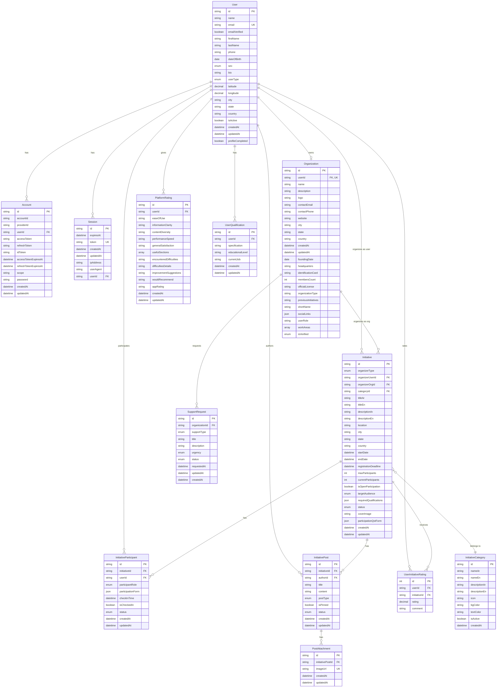

# Badir - Community Initiative Platform

**Badir** is a comprehensive platform designed to connect volunteers and participants with meaningful community initiatives. The platform enables organizations and individuals to create, manage, and participate in social impact projects across various categories.

**Purpose**: Badir aims to build stronger communities by facilitating collaboration between initiative organizers and community members, making it easier to discover, join, and contribute to positive social change initiatives.

## Features

### Core Functionality

- **Initiative Discovery**: Browse and search community initiatives with advanced filtering
- **User Authentication**: Secure login/signup for individuals and organizations
- **Profile Management**: Complete user profiles with location and preferences
- **Initiative Participation**: Join initiatives as helper or participant
- **Organization Management**: Create and manage organizational accounts
- **Rich Content Creation**: TipTap editor with image upload and formatting
- **Multi-language Support**: Arabic (RTL) and English interface
- **Responsive Design**: Optimized for desktop, tablet, and mobile

### Advanced Features

- **Dynamic Participation Forms**: Custom questions per initiative
- **Role-based Access Control**: Admin, Manager, Member roles
- **File/Image Management**: Supabase storage with safe deletion
- **Search & Filters**: Full-text search with category, location, and status filters
- **Pagination**: Efficient cursor-based data loading
- **Rating System**: Platform and initiative ratings
- **Admin Dashboard**: Initiative and organization approval workflow

## Tech Stack

### Frontend

- **Next.js 15** - React framework with App Router
- **React 19** - UI library
- **TypeScript** - Type-safe development
- **Tailwind CSS 4** - Utility-first CSS framework with RTL support
- **Shadcn/UI & Radix UI** - Accessible, composable components

### Backend & Database

- **Prisma ORM** - PostgreSQL schema and migrations
- **Better Auth** - Authentication with JWT sessions
- **Supabase** - File storage with RLS policies

### Form & Content Management

- **React Hook Form** - Form state management
- **Zod** - Schema validation
- **TipTap Editor** - Rich text editing
- **DOMPurify** - HTML sanitization

## Architecture Overview

### Folder Structure

badir-bunian-hackathon/
├── actions/ # Server actions for API logic
├── app/ # Next.js App Router pages
│ ├── (auth)/ # Authentication pages
│ ├── admin/ # Admin dashboard
│ ├── api/ # API routes
│ └── initiatives/ # Initiative pages
├── components/ # Reusable UI components
│ ├── layout/ # Footer, Navbar
│ ├── pages/ # Page-specific components
│ └── ui/ # UI primitives (Shadcn)
├── data/ # Static data, routes, statistics
├── hooks/ # Custom React hooks
├── lib/ # Utilities, auth, Supabase client
├── prisma/ # Database schema and migrations
├── schemas/ # Zod validation schemas
├── services/ # Business logic layer
└── types/ # TypeScript definitions

### Database Schema



### Data Flow

Client Request → Server Function / Next.js API Route → Service Layer → Prisma ORM → PostgreSQL

## Setup Instructions

### Prerequisites

- Node.js 18+ and npm
- PostgreSQL database
- Supabase account (for file storage)

### Installation

1. **Clone the repository**

```bash
   git clone https://github.com/MohamedMouloudj/Badir.git
   cd Badir
```

### Install dependencies

```bash
   npm install
```

### Set up environment variables

```bash
   cp .env.example .env.local
```

```bash
   cp .env.example .env.local
```

### Configure the following in .env.local:

- Database URL (PostgreSQL)
- Better Auth secrets
- Supabase credentials
- EmailJS credentials (optional)

### Set up database

```bash
   npx prisma migrate dev
   npx prisma db seed
```

### Start development server

```bash
   npm run dev
```

### Open your browser

```bash
   http://localhost:3000
```

## Key Components

### Reusable UI Components

`FormInput`: Typed input with validation and error mapping
`AppButton`: Consistent button styles with loading states
`FilterSelect`: Dynamic filtering for initiatives
`PostEditor`: TipTap-based rich text editor
`InitiativeCard`: Initiative display with status badges
`SearchInput`: Full-text search functionality
`PaginationControls`: Cursor-based pagination UI
`Ratings`: Star rating display and input

### Form Components

`FormFieldCreator`: Dynamic form builder
`SignupForm`: Multi-step registration flow
`InitiativeForm`: Initiative creation and editing
`CompleteProfileForm`: Profile completion workflow

## API Routes

```bash
/api/auth/[...all] # Better Auth handlers
/api/initiatives/ # Initiative CRUD operations
/api/organizations/ # Organization management
/api/participations/ # Participation requests
```

## Platform Next Steps

### Backend Migration

- [ ] Migrate from Supabase to dedicated backend (Express.js or Nest.js)
- [ ] Implement file management system using Buckets
- [ ] Migrate all database operations to new backend

### Initiative Features

- [ ] Add cancel initiative functionality for users with userType: User
- [ ] Create rating component for users to rate joined initiatives
- [ ] Add rating handlers and API endpoints (see [Ratings](#reusable-ui-components))
- [ ] Recommend initiatives based on user location (latitude/longitude)
- [ ] Review and fix bugs in Initiative cards:

  - [ ] `InitiativeCard` component (`/components/pages/InitiativeCard.tsx`)
  - [ ] `ParticipationCard` component (`/components/pages/ParticipationCard.tsx`)
  - [ ] `InitiativeOrgCard` component (`/components/pages/InitiativeOrgCard.tsx`)

### Channels & Editor

- [ ] Improve Tiptap editor in initiatives channels
- [ ] Add more formatting options and features
- [ ] Enhance editor UI/UX

### Admin System

- [ ] Create Admin DB table with two types: Admin, Supervisor
- [ ] Remove email-based admin check from environment variables
- [ ] Add admin authentication and authorization
- [ ] Create route to add/manage initiative categories
- [ ] Build category management interface

### Organization Management

- [ ] Create dedicated table for organization rejection notes
- [ ] Move status field to that table to track rejection states
- [ ] Implement rejection workflow and notifications

### Admin UI

- [ ] Improve Admin panel components design
- [ ] Enhance dashboard layout and navigation
- [ ] Add better data visualization and tables
- [ ] Improve user experience and responsiveness

### Email Service

- [ ] Integrate Resend (or similar email service)
- [ ] Replace all EmailJS usage with new service
- [ ] Set up email templates
- [ ] Add email notification features (verification, updates, reminders)

### Multi-language Support

- [ ] Implement i18n or Lingo.dev compiler (but make sure to not make all routes dynamic) for Arabic and English

```
<a href="https://github.com/MohamedMouloudj/Badir">Badir</a> © 2025 by <a href="https://github.com/MohamedMouloudj/">Mohamed Mouloudj</a> is licensed under <a href="https://creativecommons.org/licenses/by-nc-sa/4.0/">Creative Commons Attribution-NonCommercial-ShareAlike 4.0 International</a></br>
```
